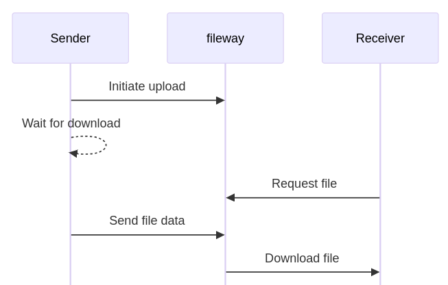
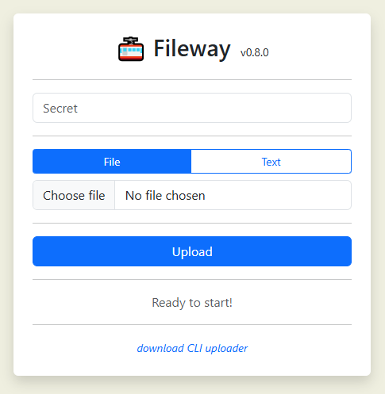

= 🚠 fileway v0.6.1
@proofrock <oss@germanorizzo.it>
:toc:
:sectnums:
:source-highlighter: highlightjs

== tl;dr

Fileway is a real-time file transfer service that works through a web browser or command line. It lets two users exchange files through an intermediary server without storing data or requiring direct access to each other's systems - like a live-streaming version of WeTransfer(TM)footnote:[WeTransfer(TM) is a trademark of WeTransfer B.V.].

== Overview

`fileway` is a client/server application that single files (<<ZIP,well, technically...>>); it blocks the upload until a download is initiated, then processes the upload and sends the data to the downloading client. It can be used to transfer files from a server to another, if the two servers don't easily "see" each other, by being installed to a third server (on the internet) that they both see.

.Sequence diagram

The transfer is secure: a unique link is generated, and you should only take care to serve it via HTTPS (<<DIWC,discussed below>>).

Uploads can be done with a web interface - works on mobile, too - or via a python3 script, for shells. Downloads can be done via a browser or using the commandline, e.g. `curl`. The uploading script or web session must be kept online until the transfer is done. Of course, multiple concurrent transfers are possible, and it transfers one file at a time.

`fileway` doesn't store anything on the server, it just keeps a buffer to make transfers smooth. It doesn't have any dependency other than `go`. It's distributed as a docker image, but you can easily build it yourself. Also provided, a docker image that includes `caddy` for simple HTTPS provisioning.

Builds are <<RAB,reproducible>>.

== Quickstart/demo

For a quick test of how it works, you can run it locally. Prerequisites are `docker`, a file to upload, nothing else.

Run the server:

[source,bash]
----
docker run --rm -p 8080:8080 -e FILEWAY_SECRET_HASHES='$2a$10$I.NhoT1acD9XkXmXn1IMSOp0qhZDd63iSw1RfHZP7nzyg/ItX5eVa' ghcr.io/proofrock/fileway:latest
----

[TIP]
====
Please note the single quotes around the secret. It contains some `$`, so if you use a double quote, bash will treat them as env vars.
====

Then open http://localhost:8080 to access the web page. Put `mysecret` as the secret, and choose a file. Press the Upload button.

In the two boxes that will be displayed, you'll find an URL to be open directly in a browser; and a `curl` commandline to download the file.

[NOTE]
====
You can use anything to download that URL, as long as it supports taking the filename from the `Content-Disposition` header. That's the `-J` switch for `curl` and the `--content-disposition` one for `wget` (still marked experimental).
====

== Installation/usage

This section expands on the previous, to explain how to set up `fileway` in a proper architecture. It assumes a certain familiarity with `docker`, we won't explain all the concepts involved.

A multi-arch docker image (arm64 and aarch64) is available in the https://github.com/users/proofrock/packages?repo_name=fileway[Packages] section of this repository. The client python script to upload files is available in the https://github.com/proofrock/fileway/releases[Releases] section.

=== Server

It's a Go application but it's tailor-made to be configured and installed via Docker.

Get a server, ideally already provisioned with a reverse proxy. `fileway` is best not exposed directly to internet, mainly because it doesn't provide HTTPS.

Generate a secret, best a long (24+) sequence of letters and numbers, and hash it using BCrypt (<<HTS,instructions>>).

[NOTE]
====
You can generate several hashes, and specify them as a comma-separated list.
====

[source,bash]
----
docker run --name fileway -p 8080:8080 -e FILEWAY_SECRET_HASHES=<secret_hash[,<another_one>,...]> ghcr.io/proofrock/fileway:latest
----

Or, via docker compose:

[source,yaml]
----
services:
  fileway:
    image: ghcr.io/proofrock/fileway:latest
    container_name: fileway
    environment:
      - FILEWAY_SECRET_HASHES=<secret_hash[,<another_one>,...]>
    ports:
      - 8080:8080
----

The following are the environment variables that you can set:

.Environment Variables
|===
| env var | default value | description

| `FILEWAY_SECRET_HASHES` | *Mandatory* | Comma-separated list of BCrypt hashes for the secrets.
| `CHUNK_SIZE_KB` | 4096 | Chunk size for upload and internal buffer.
| `BUFFER_QUEUE_SIZE` | 4 | Internal buffer queue of chunks.
| `RANDOM_IDS_LENGTH` | 33 | Length of the random strings, e.g. in download links. 11 ~= 64bit.
| `REPRODUCIBLE_BUILD_INFO` | *Not set* | If set, prints info for <<RAB,reproducing a build>> and exits.
|===

[TIP]
====
If a docker network is needed, you can set `internal: true` on it so that no outbound access is possible. `fileway` doesn't need to access any other system.
====

==== Docker image with `caddy` [[DIWC]]

It's strongly advised not to expose the server directly to the internet, for obvious reasons. You can configure a reverse proxy to add HTTPS; <<CAD,for example caddy>>.

For a simpler installation, a docker image `fileway-caddy` is available, to provide automatic HTTPS via Let's Encrypt and `caddy`. The usage is very similar to the basic image, but you must open the ports 80 and 443 (to caddy) and provide the `BASE_ADDRESS` env var to specify the web address you're publishing.

[source,bash]
----
docker run --name fileway -p 8080:8080 -e BASE_ADDRESS=fileway.example.com -e FILEWAY_SECRET_HASHES=<secret_hash[,<another_one>,...]> ghcr.io/proofrock/fileway-caddy:latest
----

=== Upload client

==== Web upload client (via browser)

A simple web client is provided. Access it by calling the "root" address, e.g. `https://fileway.example.com`. It should work fine on mobile, too.

.A screenshot of the Web UI

==== Python upload client

Download the file `fileway_ul.py` from this repository. The script doesn't have any dependency other than python3.

Edit it and configure the secret and the base URL that you exposed to internet (in the `caddy` example above, `https://fileway.example.com`).

Then just launch it:

[source,bash]
----
python3 fileway_ul.py myfile.bin
----

This will output a link with the instructions to download. The link is unique and, while public, it's quite difficult to guess.

----
== fileway v0.6.1 ==
All set up! Download your file using:
- a browser, from https://fileway.example.com/dl/I5zeoJIId1d10FAvnsJrp4q6I2f2F3v7j
- a shell, with $> curl -OJ https://fileway.example.com/dl/I5zeoJIId1d10FAvnsJrp4q6I2f2F3v7j
----

After a client initiates a download and the `fileway_ul.py` sends all the data, the `fileway_ul.py` script will exit.

[TIP]
====
[[ZIP]] You can use `--zip` as a commandline switch and specify multiple files and directories; the client will compress them to a temp file and send the result.
====

[TIP]
====
If you comment out the `SECRET` variable, the script will ask for the secret at every use.
====

=== Download link

The link provided by the uploads clients will open a download page when opened in a browser, and will download the file when opened with a CLI application. To better understand how this is done, and troubleshoot, please read the 'Understanding the download URL' section.

== Further topics

=== Hashing the secret [[HTS]]

To hash a secret using BCrypt, you can:

- Use a website, google for it. Usually these sites send the secret to their servers, so you shouldn't use them for "production" secrets.

- Use `htpasswd` from `apache-utils` (or the relevant package for your distribution). Run the following commandand remove the initial `:` from the result.

  htpasswd -nbBC 10 "" mysecret

- Use `docker` and the `caddy` image, with the following commandline.

  docker run --rm caddy caddy hash-password -p 'mysecret'

=== Understanding the download URL

Many apps that you may use to send the download URL to someone - Whatsapp, Slack, etc. - display a preview of any link you're pasting. So, if the link was one-time, it would be "used" and made invalid.

The download link points to an intermediate web page, with a download button. This way, an app would see that page, not the download link.

In the case of a commandline app, we don't want the intermediate page. `fileway` reads the `User-Agent` header of the request, and if it detects a CLI app, just serves the file instead of the page.

It should work for `curl`, `wget`, `HTTPie`, `aria2` and `axel`. Please report any more tool, I can probably support it.

At any rate, you can force the download by replacing the service in the URL. The usual link is `.../dl/...` while replacing that part with `.../ddl/...` will give you a direct download of the file. Just don't share it over Whatsapp, it will spoil it!

=== Using `caddy` as an external reverse proxy [[CAD]]

This is an excerpt of a `caddyfile`:

[source,caddy]
----
fileway.example.com {
  reverse_proxy localhost:8080
}
----

=== Building the server

In the root dir of this repository, use

[source,bash]
----
docker buildx build --build-arg VERSION=<version> --build-arg SOURCE_DATE_EPOCH=<epoch> . -f Dockerfile.simple -t fileway:<version>
----

This will generate a docker image tagged as `fileway:<version>`. `docker` and `docker buildx` must be properly installed and available.

=== Reproducing a build [[RAB]]

`fileway` is somewhat security-sensitive, so being able to reproduce a build is desirable.

In order to ensure that a distributed docker image matches the sources, you can follow these steps. I will use `v0.6.1'` for this example, later versions are ok also.

First of all, in a temp directory, extract the executable file from the official image:

[source,bash]
----
mkdir tmp && cd tmp
docker create --name temp ghcr.io/proofrock/fileway:v0.6.1 # or fileway-caddy
docker export temp | tar xf - fileway
docker rm temp
----

Get the MD5 of the file and the parameters that were used to build it:

[source,bash]
----
md5sum fileway
# 4855b28b1dcd089265b9472a5a020621  fileway
REPRODUCIBLE_BUILD_INFO=1 ./fileway 
# ...
# Variables used for this build:
# - VERSION='v0.6.1'
# - SOURCE_DATE_EPOCH='47836427937'
----

Finally, download the correct version of the official repository, generate a binary with the appropriate dockerfile, using the values from the last output as the env vars values.

Finally, confront the MD5 of the generated file.

[source,bash]
----
git clone -b "v0.6.1" https://github.com/proofrock/fileway fwrepo
cd fwrepo
docker build --build-arg VERSION='v0.6.1' --build-arg SOURCE_DATE_EPOCH='47836427937' --output=. -f Dockerfile.binary .
md5sum fileway
# 4855b28b1dcd089265b9472a5a020621  fileway
----
