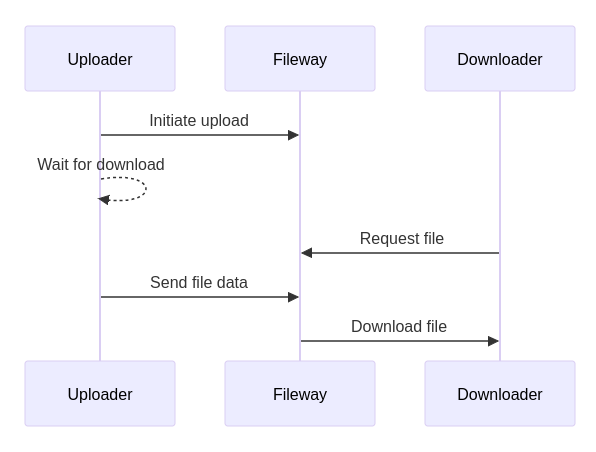

# 🚠 fileway v0.4.1

`fileway` is a client/server application that accepts an upload of a single file; it blocks the upload until a download is initiated, then processes the upload and sends the data to the downloading client. It can be used to transfer files from a server to another, if the two servers don't easily "see" each other, by being installed to a third server (on the internet) that they both see.



The transfer is secure: a unique link is generated, and you should only take care to serve it via HTTPS (see the relevant section below).

Uploads can be done with a web interface - works on mobile, too - or via a python3 script, for shells. Downloads can be done via a browser or using the commandline, e.g. `curl`. The uploading script or web session must be kept online until the transfer is done. Of course, multiple concurrent transfers are possible, and it transfers one file at a time.

`fileway` doesn't store anything on the server, it just keeps a buffer to make transfers smooth. It doesn't have any dependency other than `go`. It's distributed as a docker image, but you can easily build it yourself. Also provided, a docker image that includes `caddy` for simple HTTPS provisioning.

## Quickstart/demo

For a quick test of how it works, you can run it locally. Prerequisites are `docker`, a file to upload, nothing else.

Run the server:

```bash
docker run --rm -p 8080:8080 -e FILEWAY_SECRET_HASHES='$2a$10$I.NhoT1acD9XkXmXn1IMSOp0qhZDd63iSw1RfHZP7nzyg/ItX5eVa' ghcr.io/proofrock/fileway:latest
```

Then open [http://localhost:8080](http://localhost:8080) to access the web page. Put `mysecret` as the secret, and choose a file. Press the Upload button.

In the two boxes that will be displayed, you'll find an URL to be open directly in a browser; and a `curl` commandline to download the file.

> 💡 You can use anything to download that URL, as long as it supports taking the filename from the `Content-Disposition` header. That's the `-J` switch for `curl` and the `--content-disposition` one for `wget` (still marked experimental).

## Installation/usage

This section expands on the previous, to explain how to set up `fileway` in a proper architecture. It assumes a certain familiarity with `docker`, we won't explain all the concepts involved.

A multi-arch docker image (AMD64 and AARCH64) is available in the 'Packages' section of this repository. The client python script to upload files is available in the 'Releases' section.

### Server

It's a Go application but it's tailor-made to be configured and installed via Docker.

Get a server, ideally already provisioned with a reverse proxy. `fileway` is best not exposed directly to internet, mainly because it doesn't provide HTTPS.

Generate a secret, best a long (24+) sequence of letters and numbers (to avoid problems with escapes), and hash it using BCrypt (too see how, read later, 'Hashing the secret').

> 💡 You can generate several hashes, and specify them as a comma-separated list.

```bash
docker run --name fileway -p 8080:8080 -e FILEWAY_SECRET_HASHES=<secret_hash[,<another_one>,...]> ghcr.io/proofrock/fileway:latest
```

Or, via docker compose:

```yaml
services:
  fileway:
    image: ghcr.io/proofrock/fileway:latest
    container_name: fileway
    environment:
      - FILEWAY_SECRET_HASHES=<secret_hash[,<another_one>,...]>
    ports:
      - 8080:8080
```

> 💡 If a docker network is needed, you can set `internal: true` on it so that no outbound access is possible. `fileway` doesn't need to access any other system.

#### Docker image with `caddy`

It's strongly advised not to expose the server directly to the internet, for obvious reasons. You can configure a reverse proxy to add HTTPS; in this case read (for example) 'Using `caddy` as an external reverse proxy' later on.

For a simpler installation, a docker image `fileway-caddy` is available, to provide automatic HTTPS via Let's Encrypt and `caddy`. The usage is very similar to the basic image, but you must open the ports 80 and 443 (to caddy) and provide the `BASE_ADDRESS` env var to specify the web address you're publishing.

```bash
docker run --name fileway -p 8080:8080 -e BASE_ADDRESS=fileway.example.com -e FILEWAY_SECRET_HASHES=<secret_hash[,<another_one>,...]> ghcr.io/proofrock/fileway-caddy:latest
```

### Upload client

#### Web upload client (via browser)

A simple web client is provided. Access it by calling the "root" address, e.g. `https://fileway.example.com`. It should work fine on mobile, too.


#### Python upload client

Download the file `fileway_ul.py` from this repository. The script doesn't have any dependency other than python3.

Configure it with the secret and the base URL that you exposed to internet (in the `caddy` example above, `https://fileway.example.com`).

Then just launch it:

```bash
python3 fileway_ul.py myfile.bin
```

This will output a link with the instructions to download. The link is unique and, while public, it's quite difficult to guess.

```text
== fileway v0.4.1 ==
All set up! Download your file using:
- a browser, from https://fileway.example.com/dl/I5zeoJIId1d10FAvnsJrp4q6I2f2F3v7j
- a shell, with $> curl -OJ https://fileway.example.com/dl/I5zeoJIId1d10FAvnsJrp4q6I2f2F3v7j
```

After a client initiates a download and the `fileway_ul.py` sends all the data, the `fileway_ul.py` script will exit.

#### User Agent filtering

Many services that may be use to send the download link to the recipient (e.g. Whatsapp, Teams, Slack...) will try to display a preview of the link. This would make the link expire, of course: it's an one time link, after all.

In order to try and mitigate this, the user agent of a download call is searched in [this blacklist](https://raw.githubusercontent.com/monperrus/crawler-user-agents/refs/heads/master/crawler-user-agents.json) [MIT License]. If it's found, a generic text is displayed.

## Building the server

In the root dir of this repository, use `docker buildx build . -f Dockerfile.simple -t fileway:v0.4.1`. This will generate a docker image tagged as `fileway:v0.4.1`.

`docker` and `docker buildx` must be properly installed and available.

## Further topics

### Hashing the secret

To hash a secret using BCrypt, you can:

- Use a website, google for it. Usually these sites send the secret to their servers, so you shouldn't use them for "production" secrets.

- Use `htpasswd` from `apache-utils` (or the relevant package for your distribution). Run the following commandand remove the initial `:` from the result.
  ```bash
  htpasswd -nbBC 10 "" mysecret
  ```
- Use `docker` and the `caddy` image, with the following commandline.
  ```bash
  docker run --rm caddy caddy hash-password -p 'mysecret'
  ```

### Using `caddy` as an external reverse proxy

This is an excerpt of a `caddyfile`:

```caddyfile
fileway.example.com {
  reverse_proxy localhost:8080
}
```

