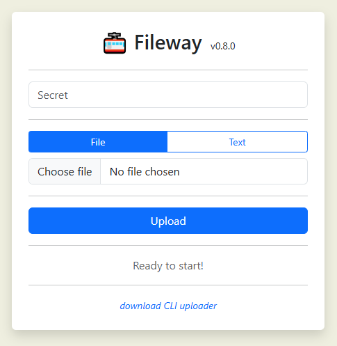

= Uploading
@proofrock <oss@germanorizzo.it>
:toc:
:sectnums:
:source-highlighter: highlightjs

== At a glance

* There are two upload clients, one for browsers and one for CLI;
* Both need a secret to connect to the server;
* The Web interface:
** Is simple but "just enough";
** Can upload single files;
** Single page written in HTML5 and Javascript;
** Can show a QR code for easier download from mobile devices;
* The CLI interface:
** Pure Python 3footnote:[Python is not my "first language", so while it's simple enough, feel free to read the code and tell me if something's amiss!], no dependencies;
** Can zip multiple files or directories to a temporary zip, before uploading it;
** Can save the secret to the user's home.

== The Web UI

You can access it by opening the base address in a reasonably modern browser. It should work on the desktop and on mobile.

Something like this should be shown:

.A screenshot of the Web UI

Simply provide the secret, and either choose a file or input a text to share. Then click "Upload".

== The CLI script

=== Obtaining it

The script can be downloaded from the main fileway page, from the link at the bottom.

Also, it can be downloaded appending `/fileway_ul.py` to the base URL.

You'll probably want to set the executable flag on it.

[source,bash]
----
curl -O https://fileway.example.com/fileway_ul.py
chmod +x fileway_ul.py
----

[NOTE]
====
The downloaded script is tailor-made for your installation; the URL of the service gets substituted in it. If you need to change this, look at the variable `BASE_URL`
====

=== Using it

==== For files

As simple as possible: just run it with a file as the only argument.

[source,bash]
----
./fileway_ul.py myfile.bin
----

It look for the secret:
* in a env variable named `FILEWAY_SECRET`;
* in a file in the user's home directory, called `.fileway-creds`;
* prompting for user input. 

In all cases, the secret can be saved to avoid asking for it; see xref:#SAV[the relevant section].

After setting up the upload, it prints the information for the download. Something of the sort:

----
All set up! Download your file using:
- a browser, from https://fileway.example.com/dl/I5zeoJIId1d10FAvnsJrp4q6I2f2F3v7j
- a shell, with $> curl -OJ https://fileway.example.com/dl/I5zeoJIId1d10FAvnsJrp4q6I2f2F3v7j
----

Keep the script open until the upload is done. It exits automatically when it's finished.

==== For text

If you want to share a text, use the `--txt` commandline arguments, with the text as the other argument.

=== Advanced usage

----
== Fileway vX.Y.Z ==

usage: fileway_ul.py [-h] [--save] [--zip] [files ...]

Uploader for Fileway

positional arguments:
  files       List of files if --zip, just one if not

options:
  -h, --help  show this help message and exit
  --save      Save the secret to user home
  --zip       Enable zip mode
----

The options are explained in the next sections.

==== `--zip`: Zipping multiple files [[ZIP]]

If you want to upload multiple files, the script will happily zip them to a temporary file, upload that file  and delete it.

[source,bash]
----
./fileway_ul.py --zip myfile.bin mydir/ myfile2.bin
----

Please note that:

* The recipient will download a zip file;
* Your temp directory must have enough free space to hold the temp file;
* The script uses Python's features to delete the file, but there may be some cases in which it's not possible to do it (e.g. if the OS halts abruptly);
** In this case, check in the temp directory for any file named `fileway_*.zip`.

==== `--save`: Save the secret [[SAV]]

If `--save` is specified, the secret (obtained via env var or asking to the user) is saved to a file in the user home directory, called `.fileway-creds`.

`0400` permissions are set to it, when in Unix; this attempts to make it read only, just for the owner.

[WARNING]
====
The secret is obfuscated, but must still be considered as plain text.
====
